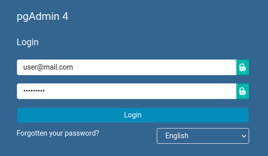
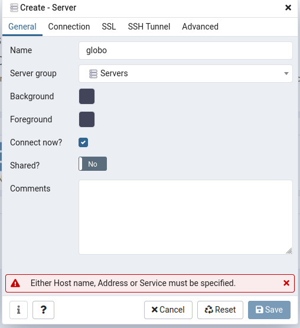
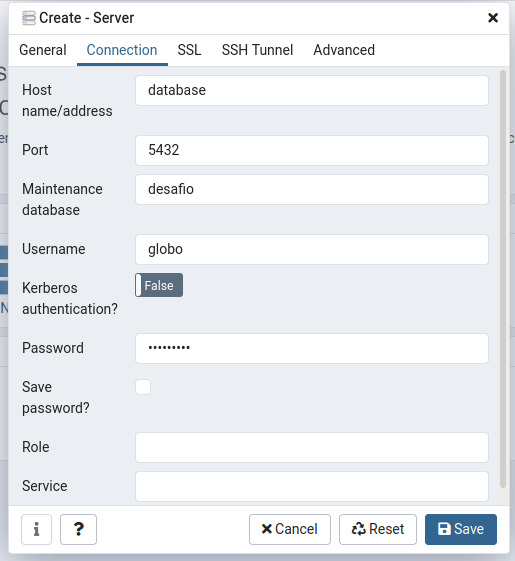
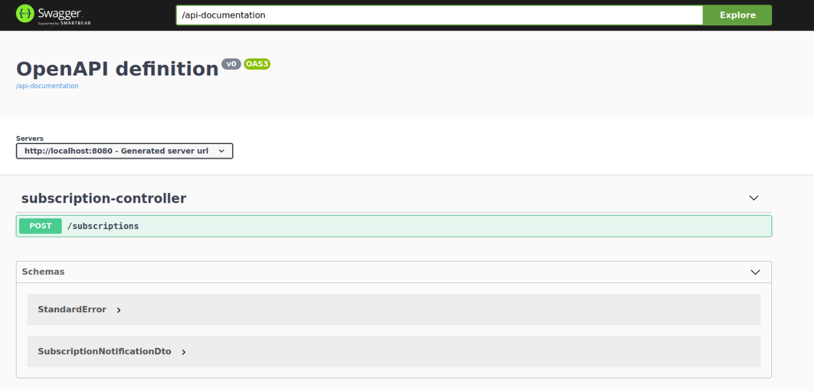
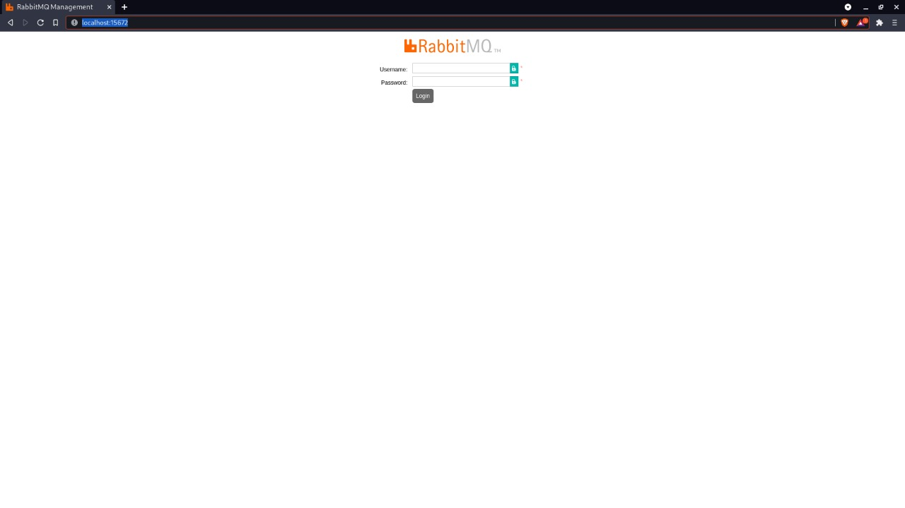
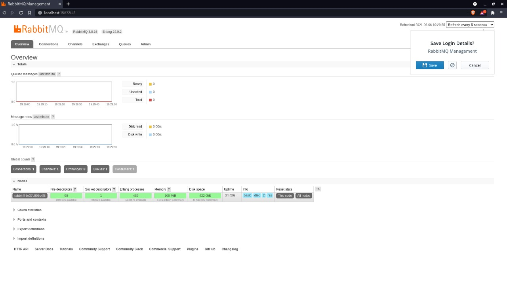

#Setup

<hr>

Sistemas operacionais testos:
- Ubuntu 20.04 :heavy_check_mark:
- Fedora 34 :heavy_check_mark:


Para o funcionamento da aplicação é necessário a instalação do <a href="https://docs.docker.com/engine/install/ubuntu/" targe="_blank">Docker 20.10.7, build f0df350</a> e do <a href="https://docs.docker.com/compose/install/" targe="_blank">Docker compose 1.29.2, build 5becea4c</a>, pode ser que seja necessario instalar o <a href="https://www.python.org/downloads/" target="_blanl">Python 3.8.5</a> na maquina e o <a href="https://openjdk.java.net/install/" target="_blank">Openjdk 11.0.11</a>, o maven também é algo que é necessario instalar para instalar o maven use o seguinte comando:

Ubuntu
```sudo apt install maven```

Fedora ```sudo dnf install maven```

Com um terminal aberto execute a seguinte sequência de comandos:

```
git clone https://github.com/juliocesarnt/rabbit-pgjbz.git
cd rabbit-pgjbz
docker-compose up -d
python3 req.py
```

Caso queira dar build na imagem docker da aplicação antes de utilizar o ```docker-compose up -d``` utilize o seguinte comando:

```
mvn clean compile jib:dockerBuild
```

Feito estes passos ira iniciar 4 containers, contendo o RabbitMQ, PostgreSQL, PgAdmin e a aplicação do desafio e as requisições serão feitas.

Para verificar os registros abra um navegador e acessa a url http://localhost use as seguintes credenciais:

email: user@mail.com <br>
password: secret123



No dashboard adicione o banco de dados clicando na opção , onde sera aberta uma janela para o input das configurações de conexão:



De um nome qualquer e clique em Connection:



Coloque as seguintes configurações:

``` 
    Host name/address = database
    Port = 5432
    Maintenance database = desafio
    Username = rabbit
    Password = secret123
```

Clicando em tools e depois em query tools é possivel utilizar realizar consultas utilizando comandos sqls

Para acessar a documentação das requisições basta ir no navegador e digitar o seguinte endereço: http://localhost:8080/documentation, ira abrir uma pagina do OpenAPI parecida com esta




Para acessar o painel de controle do RabbitMQ vá no navegador e digite o seguinte endereço http://localhost:15672/

Ira abrir uma pagina parecida com esta



Para efetuar o login o usuario padrão é ```guest``` e a senha é ```guest```, feito sucesso você ira para a página de overview



Nesta página é possivel ter uma visão geral das mensagens enviadas ao RabbitMQ

<hr>

#Possiveis configurações do projeto

Utilizando o comando ```mvn clean install``` dentro da pasta desafio é possivel dar o build no jar, da aplicação. A mesma
tem as seguintes configurações com as variaveis de ambiente:

- ```JDBC_HOST``` onde é definido o host do banco Postgres o valor padrão é ```localhost```
- ```JDBC_PORT``` onde é definido o a porta do banco Postgres o valor padrão é ```5432```
- ```DATABASE``` onde é definido o nome do banco Postgres o valor padrão é ```desafio```
- ```JDBC_USER``` onde é definido o nome do usuario banco Postgres o valor padrão é ```rabbit```
- ```JDBC_PASSWORD``` onde é definido o nome do usuario banco Postgres o valor padrão é ```secret123```
- ```RABBITMQ_HOST``` onde é definido o host do RabbitMQ o valor padrão é ```localhost```
- ```RABBITMQ_PORT``` onde é definido a porta do RabbitMQ o valor padrão é ```5672```
- ```RABBITMQ_USERNAME``` onde é definido o usuario do RabbitMQ o valor padrão é ```guest```
- ```RABBITMQ_PASSWORD``` onde é definido a senha do usuario do RabbitMQ o valor padrão é guest


